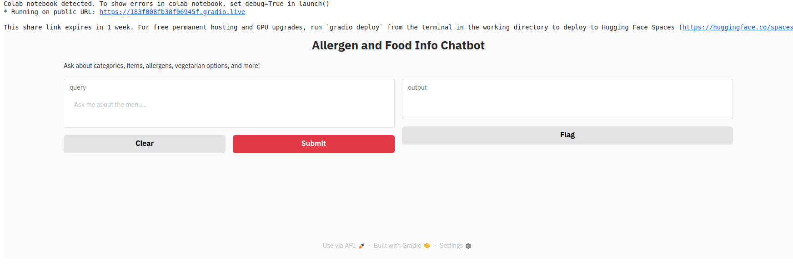

# Restaurant Data Scraper & RAG-Based Chatbot

## Introduction

This project is an end-to-end Generative AI solution designed to enhance restaurant discovery experiences. It combines **web scraping**, **knowledge base creation**, and **Retrieval-Augmented Generation (RAG)** to allow users to ask natural language questions about restaurants — and get accurate, contextual, and human-like responses.

The solution is built entirely using open-source tools, designed to be lightweight, efficient, and easily extensible.

---

## Problem Statement

Users often have specific questions about restaurants — such as menu item details, dietary accommodations, or comparisons across establishments — that traditional search interfaces cannot effectively handle. 

This project addresses that gap by:
- Scraping structured, real-world restaurant data from the web.
- Building two types of searchable knowledge bases (Relational Database and Vector Database).
- Implementing a **RAG-based chatbot** that retrieves the most relevant information and generates fluent responses.

---

## System Architecture

The system consists of several core components, organized into two complementary approaches for retrieval:

### 1. Relational Database-Based Approach
- Scraped data is cleaned, normalized, and stored in a **relational SQL database**.
- SQL-based retrieval is performed using natural language to SQL translation.
- Frameworks/Tools:
  - **LangChain** (SQLChain for relational retrieval)
  - **SQLAlchemy** (ORM for relational database handling)
  - **sqlite3** (lightweight SQL database engine)

> Note: As the data was structured used relational databased approach for fater and accurate response. [Reference](https://python.langchain.com/docs/concepts/retrieval/)

### 2. Vector Database-Based Approach
- Scraped data is embedded into dense vectors using **Hugging Face's InstructEmbeddings**.
- Vectors are stored in a **FAISS** index for similarity-based retrieval.
- Frameworks/Tools:
  - **LangChain** (RetrievalQA over vector stores)
  - **FAISS** (efficient similarity search)
  - **google/flan-t5-large** (generation model via Hugging Face Transformers)

> Note: Vector retrieval allows fuzzy, semantic, and flexible querying based on context.

### Common Generation Backbone
Both retrieval approaches pass retrieved information to a powerful generative model:
- Model: **google/flan-t5-large**
- Framework: **Hugging Face Transformers**
- Served through a **HuggingFacePipeline** integrated into LangChain RAG chains.

---

## 🛠️ Key Frameworks & Libraries Used

| Component | Tool/Library |
|:---|:---|
| Web Scraping | BeautifulSoup, Requests |
| Relational DB Management | sqlite3, SQLAlchemy, LangChain SQLChain |
| Vector Embedding | MiniLM |
| Vector DB | FAISS |
| Retrieval and RAG Framework | LangChain |
| Language Model | google/flan-t5-large (via Hugging Face Transformers) |
| UI (Future Work) | Gradio |

---

## Project Structure

```bash
├── scrapers
├── data
├── rag
│   ├── rag_relationaldb.py
│   └── rag_vectordb.py
├── README.md
└── requirements.txt
```
---

# Setting Up the Project

Follow these steps to set up the project locally on your machine:

```bash
-git clone https://github.com/vm349177/Zomato_Assignment.git
```
```bash
-cd restaurant-rag-chatbot
-python3 -m venv venv
```
```bash
-source venv/bin/activate  # For Linux/Mac
-.\venv\Scripts\activate   # For Windows
```
---
## GUI


## VIDEO
[VIDEO](https://drive.google.com/drive/folders/1xXinQKZMCLIIAIOqkojiaf9kryomK7M-?usp=sharing)

